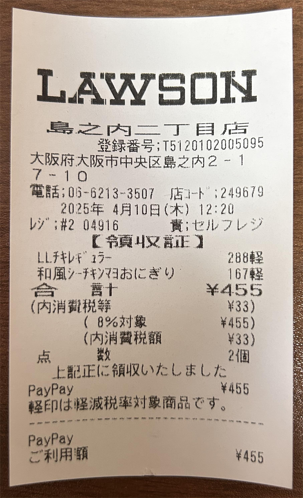

# レシートの分類モデル

---

## 1. プロジェクト概要

ResNet50を用いた画像分類のディープラーニングプロジェクトです。  
コンビニのレシートと非コンビニのレシートという2種類のラベルからなるカスタムデータを使用し、データの準備、学習、テスト、評価までの一連のプロセスを実施しています。

---

## 2. プロジェクト構成

<pre>
.
├── config/             # プロジェクト内の各種パラメータの数値を定義するyamlファイルを含む
├── data/               # 学習・推論用の画像（コンビニレシート／非コンビニレシート）を含むフォルダ
├── images/             # README.md用画像置き場
├── logs/               # 事前学習済みモデルおよび学習・推論完了後の保存ファイルを配置するフォルダ
├── nets/               # ResNet50ニューラルネットワーク構造のコードを含む
├── utils/              # 学習・推論およびデータ水増しなどを行うツールコードを含む
├── requirements.txt    # Pythonの依存ライブラリ
├── test.py             # テストスクリプト
├── train.py            # 学習スクリプト
└── README.md           # プロジェクトの説明ドキュメント
</pre>

---

## 3. データ準備

自前で収集したコンビニレシートおよびその他の非コンビニレシート（例：新幹線の領収書、銀行の利用明細票など）を用いて学習とテストを行いました。  

- 学習用：各ラベル50枚、計100枚  
- 検証用：各ラベル20枚、計40枚  
- テスト用：各ラベル5枚、計10枚  

学習データには、ニューラルネットワークに入力する前に [imgaug](https://github.com/aleju/imgaug) を用いてデータ水増しを施していますが、検証データおよびテストデータには水増しを行っていません。

画像データは `data/` フォルダ内の `train`、`val`、`test` に配置され、フォルダ名でラベルが定義されます。  
また、学習の安定性向上と高速化のため、ResNet50の事前学習済みモデルを `logs/` フォルダに事前に用意しています。

---

### クラス別画像例

**Class 0：コンビニレシート画像の例**  
 

**Class 1：非コンビニレシート画像の例**  
 

---

## 4. モデル学習

Google Colabは無料でGPUを利用できるため、GPUを用いた学習はGoogle Colabプラットフォームで実施しました。まず、プロジェクトのコードおよびデータをGoogleドライブにアップロードします。その後、Colab上で以下の手順に沿ってコードを実行し、Googleドライブに接続し、プロジェクトフォルダへ移動、Pythonの依存ライブラリをインストールし、train.pyを実行して学習を行います。

```python
from google.colab import drive
drive.mount('/content/drive')

import os
os.chdir('/content/drive/MyDrive/classfication')

!pip install -r requirements.txt

%run train.py
```

100 epochで学習を完了しました。  
最後の数epochではaccuracyが98.9%を維持しており、  
学習したモデルが検証データセット上で優れた分類性能を示していると考えられます。


---

## 4. テスト／推論

学習完了後、[`test.py`](./test.py) を実行して学習済みモデルを読み込み、  
テストデータセットに対して推論を行い、混同行列（confusion matrix）を出力します。  

結果は、テストセットの10枚の画像すべてが正しいラベルに分類されており、  
accuracyは100%に達しました。


---

## 5. 付録

本プロジェクトで使用したデータ水増しライブラリは [imgaug](https://github.com/aleju/imgaug) であり、  
複数の水増し方法を組み合わせることでモデルの汎化能力を向上させています。

