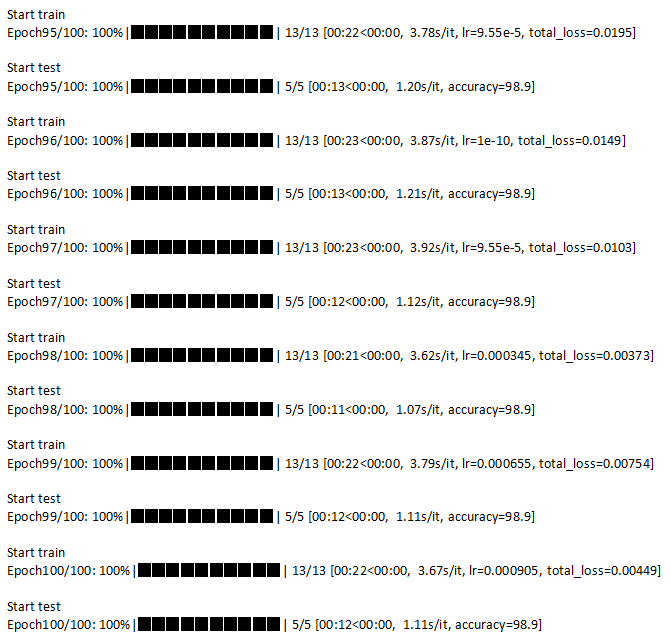

**レシートの分類モデル**

1. プロジェクト概要

ResNet50を用いた画像分類のディープラーニングプロジェクトです。コンビニのレシートと非コンビニのレシートという2種類のラベルからなるカスタムデータを使用し、データの準備、学習、テスト、評価までの一連のプロセスを実施しています。

プロジェクト構成
.
├── config/             # プロジェクト内の各種パラメータの数値を定義する yamlファイルを含む
├── data/               # 学習・推論用の画像（コンビニレシート／非コンビニレシート）を含むフォルダ
├── images/             # README.md用画像置き場
├── logs/               # 事前学習済みモデルおよび学習・推論完了後の保存ファイルを配置するフォルダ
├── nets/               # ResNet50ニューラルネットワーク構造のコードを含む
├── utils/              # 学習・推論およびデータ水増しなどを行うツールコードを含む
├── requirements.txt    # Pythonの依存ライブラリ
├── test.py             # テストスクリプト
├── train.py            # 学習スクリプト
└── README.md           # プロジェクトの説明ドキュメント

2. データ準備

自前で収集したコンビニレシートおよびその他の非コンビニレシート（例：新幹線の領収書、銀行の利用明細票など）を用いて学習とテストを行いました。学習用には、各ラベルにつき50枚、合計100枚の画像を使用し、検証用には各ラベルにつき20枚、合計40枚の画像を使用しました。テスト用には各ラベルにつき5枚、合計10枚の画像を使用しました。

学習データには、ニューラルネットワークに入力する前にimgaugを用いてデータ水増しを施しましたが、検証データおよびテストデータにはデータ水増しを行っていません。

すべての学習・テスト用の画像データは、dataフォルダ内のtrain、test、valフォルダに配置され、フォルダ名によってラベルを定義しています。

また、学習の高速化および安定性の確保のために、学習前にResNet50の事前学習済みモデルを準備し、logsフォルダに配置して学習時に呼び出せるようにしています。

（class 0）コンビニレシート画像の例：
 

（class 1）非コンビニレシート画像の例：
 

3. モデル学習

Google Colabは無料でGPUを利用できるため、GPUを用いた学習はGoogle Colabプラットフォームで実施しました。

まず、プロジェクトのコードおよびデータをGoogleドライブにアップロードします。その後、Colab上で以下の手順に沿ってコードを実行し、Googleドライブに接続し、プロジェクトフォルダへ移動、Pythonの依存ライブラリをインストールし、train.pyを実行して学習を行います。

```
from google.colab import drive
drive.mount('/content/drive')

import os
os.chdir('/content/drive/MyDrive/classfication')

!pip install -r requirements.txt

%run train.py
```

100 epochで学習を完了します。最後の数epochではaccuracyが98.9%を維持しており、学習したモデルが検証データセット上で優れた分類性能を示していると考えられます。



4. テスト／推論

学習が完了した後、[test.py](./test.py) を実行して学習済みモデルを読み込み、テストデータセットのデータに対して推論を行い、混同行列（confusion matrix）を出力します。結果は、テストセットの10枚の画像すべてが正しいラベルに分類されており、accuracyは100%に達しました。


5. 付録

本プロジェクトで使用したデータ水増しライブラリは[imgaug](https://github.com/aleju/imgaug)であり、複数の水増し方法を組み合わせることでモデルの汎化能力を向上させています。
